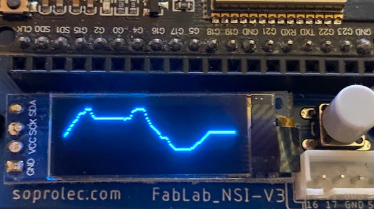

## Tracer une courbe sur l'écran OLED 128x32

Notions abordées :  

- Utiliser des librairies externes ( gestion de l'écran )
- Aborder le principe des bus de communication pour le transfert de données ( bus I2C )
- Notion de conversion d'une grandeur analogique (0 ; 3.3 V)  en valeur numérique ( 0 ; 4095 )
-  Convertir une plage de valeurs possibles ( Potentiomètre : 0 ; 4095 ) en une autre exploitable ( hauteur du spot lumineux : 0 ; 31 )
- Utilisation du bouton poussoir
