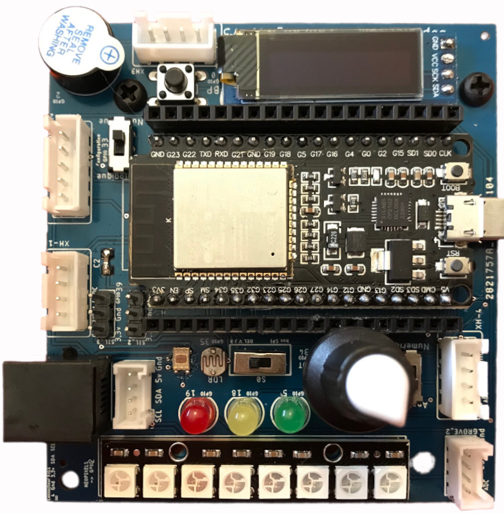

# Carte ESP32 - MicroPython

Carte à base d'ESP32 développée pour des activités pédagogiques.

Les éléments embarqués sur la carte permettent d'élaborer des scénari pédagogiques pour aborder des notions avec une approche concrète ( liste chaînée, dictionnaire, programmation orientée objet, ... ).

Contrairement à d'autres cartes, tous les éléments sont précâblés et directement accessibles. Des modules d'extensions sont possibles grace aux différents connecteurs.

Leds Rouge / Jaune / Verte : indicateurs de seuils

Potentiomètre : conversion analogique / numérique

Bouton poussoir : détection d'évènement

Buzzer passif : production de sons avec divers fréquences

ruban de leds NeoPixel : indicateur de niveau

Capteurs de lumière : résistif (LDR) ou numérique (TSL2561)

Ecran OLED : 132x27 pixels (permet par exemple d'afficher l'adresse IP de la carte en mode objet connecté )

Connecteurs : RJ11 (I2C+2p) / SIL (3.3V) / XH4p (5V) / XH5p (5V) / Grove
